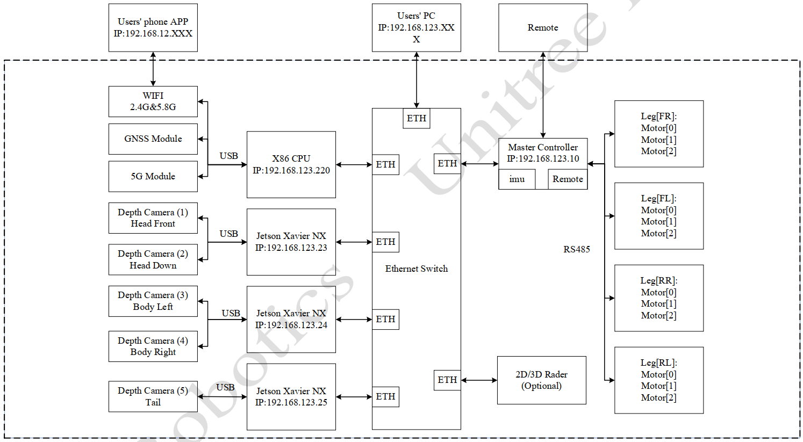
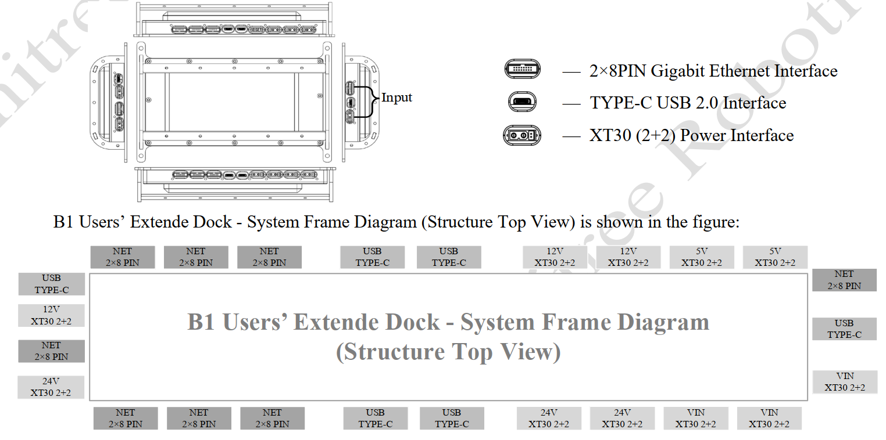
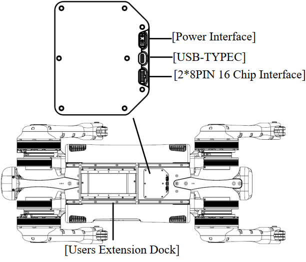
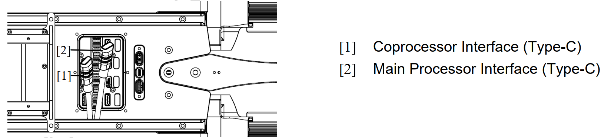
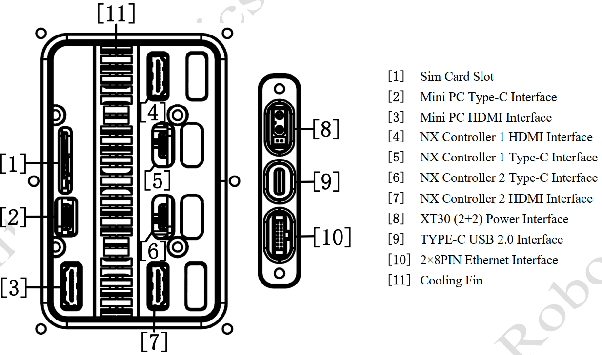

# Network Architecure
The operating system of Mini PC is a real-time Linux (Ubuntu) operating system. The
system architecture diagram is shown in the figure:

# Expansion Interfaces
The back of the B1 provides sdk expansion interfaces to develop more extended functions for users. It includes 3 input interfaces (Gigabit Ethernet interface, Type-C interface, power interface), 7 Gigabit Ethernet extension interfaces, 5 Type-C extension interfaces, and 10 power extension interfaces. The sdk expansion interfaces are as shown in the figure below.

### Type-C USB2.0 Interface:
1) Total number of interfaces: 6 interfaces (Type-C waterproof interface)
2) 7-channel USB-HUB: The generatrix is connected to the robot dog MINIPC. 5 channels are connected to the
external; 2 channels are connected to 2 groups of USB, and then transfer to 485 (or CAN) Pass-through modules:
CHA/CHB
3) Power output: 5V/1A×5 channels (USB power supply is independent of external power supply)

### 2×8PIN Gigabit Ethernet Interface+12V Power Supply+485/CAN (Pass-through) Interface:
1) Total number of Interfaces: 8 interfaces (2×8PIN waterproof interfaces)
2) Gigabit Ethernet: 1 channel is connected to the robot dog Mini PC, 7 channels are connected to external
3) Power Output: 12V × 7 channels, 10A electric current in total (same path as external power supply)
4) 485/CAN (Pass-through): 3-Interface CHA channel 485/CAN, 3-interface CHB channel 485/CAN

### XT30(2+2) power supply +485/CAN (Pass-through) interface:
1) 36-58V input/output: 3 channels 10A electric current in total, CHA channel 2 interfaces 485/CAN + CHB channel
1interfacet CAN/485
2) 24V output: 3 channels 10A electric current in total, CHA channel 2 interfaces 485/CAN + CHB channel 1
interface CAN/485
3) 12V output: 3 channels 10A electric current in total, CHB channel 2 interfaces 485/CAN + CHA channel 1
interface CAN/485
4) 5V output: 2 channels 5A electric current in total, CHB channel 1 interface 485/CAN + CHA channel 1 interface
CAN/485

# Hardware interface
Interface is provided in the back cover of B1 for users, through which developers can directly
access to Mini PC and NX controller. The hardware interface is shown in the figure, in which the head NX controller
does not open the Type-C and HDMI interface.

The back cover of B1 also provides two interfaces, namely the main processor Type-C interface and the coprocessor
Type-C interface. The PC can be directly connected to the B1 core controller through these two interfaces. The main
processor interface and coprocessor interface are used for:
- Firmware upgrade.
- Real-time broadcast of hardware status information.
- Troubleshooting. When B1 fails, users can check the status of B1 through these two interfaces and conduct
preliminary fault analysis and diagnosis.

