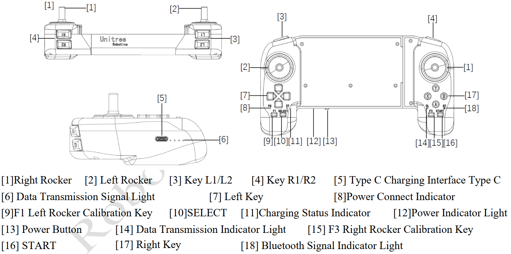
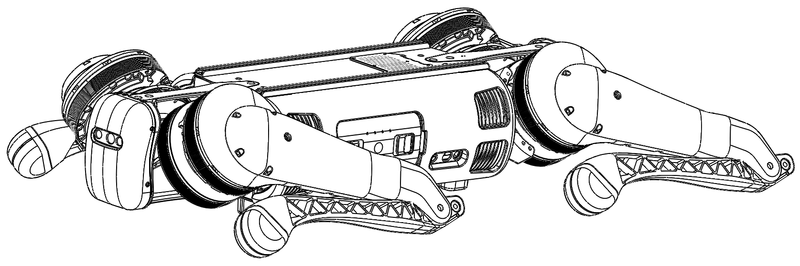
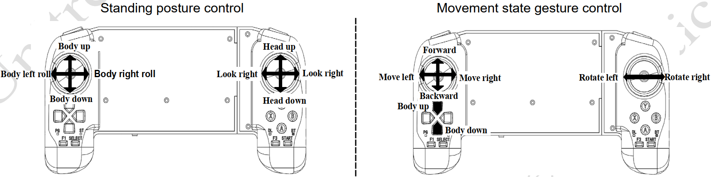
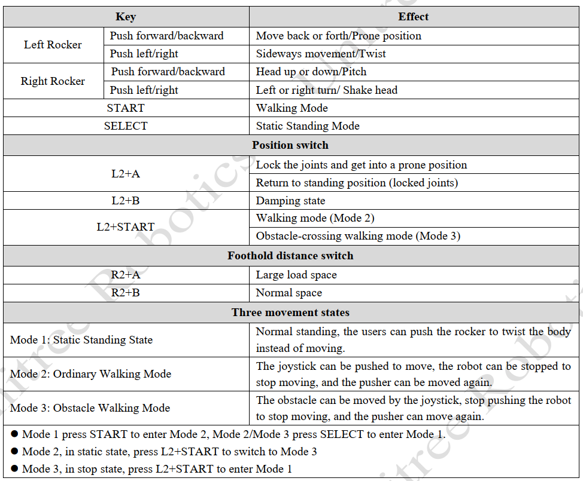
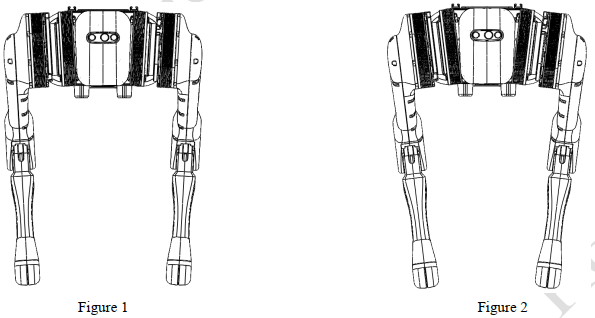

# B1 Robot

The B1 industrial protection level quadruped robot consists of B1 itself and remote control. The robot has 12 degrees
of freedom (12 high-performing joint units), 3 degrees of freedom for a single leg. The force control technology is used
to control the force and position of each joint, so that it makes user achieve the force control of the machine and obtain
excellent movement performance, with a nominal maximum standing load of 80kg and a nominal continuous load of 20kg. 

# Operating Mode Description
The Operating Mode and Walking Mode supported by B1 are as follows:
1) Static Standing:  state means that the robot fuselage position is at the initial height after boot and stand, the fuselage is horizontal, and the 3-axis attitude and 3-axis position control can be completed by the joystick. In the static standing state, the walking mode can be switched by the remote control button **START**, and the walking mode can be switched back to the static standing state by the remote control button **SELECT**.
2) Walking Mode, which can be divided into ordinary walking mode and obstacle walking mode.
   - Ordinary Walking Mode: The robot completes the actions of forward and backward, left, and right sideways, and turning in place by controlling the remote control.
   - Obstacle Walking Mode: The robot completes the actions of forward and backward, left and right side shift, in-place turn, crossing obstacles, climbing stairs, and slopes by controlling the remote control.

# Remote Control
The remote control is part of the B1 remote control module, and the remote control handle has a installed digital
transmission module and a bluetooth module. The robot dog communicates with the remote control through the data
transmission module to achieve one-to-one correspondence, and remote control can be connected when the robot is on. 

# Robot Operation
1) Put the B1 on the flat ground and install the battery pack into the battery slot from the side of the robot dog.
2) Please make sure that the robot dog is placed on a flat ground before startup and operation:

3) Briefly press the power switch [13] of the remote control once, and then long press the power switch for more than 2 seconds. The users can turn on the remote control when they hear "tick" ~”. The remote control corresponds to the data transmission module of the robot dog one-to-one, and it can be connected automatically when it is turned on. All the data transmission signal lights on the left side of the handle indicate that the connection is successful, and the remote control can control the robot dog. 
4) Turn on the battery (when the battery is on, the indicator light is green, and the indicator light shows the
current battery level). After the battery starts, wait for 2 minutes, the robot stands, the fuselage height is about 63cm,
parallel to the ground, that is, the robot is power on successfully:
    1. After powering on, the robot directly enters the ordinary walking mode, at this time you can push the joystick to control the robot forward and backward, shift side to side, in-place turning, etc., if you do not push the joystick, it will stop moving. 
    2. When the walking mode is stationary, press SELECT-> to enter a static standing state, at which point you can control the position through the joystick.
    3. In static standing state, press START-> into walking mode.
    4. In ordinary walking state, press L2+START-> to switch obstacle mode. At this point, the joystick can be pushed to control the robot to walk over obstacles and climb stairs, and if the joystick is not pushed, it will stop moving. Crossing the obstacle walking mode by pressing L2+START can switch back to the normal walking mode.
    5. In walking state, press R2+A-> switch to large load spacing to move. In this case, some extreme sports performance will be sacrificed to reduce the heat generation of the fuselage motor, so that the load operation can be more stable and reliable.
    6. With large load spacing movement, press R2+B-> switch to normal spacing movement.
    7. In any state, press L2+A-> to lock the robot and press START to unlock the robot.
    8. After the robot locks, press L2+A The robot is in a lying state. (i.e., press L2+A 2 times, and the robot completes locking - lying down)
    9. Press L2+A to stand up in the lying state, currently the robot is in a locked state, press START to unlock the robot. (That is, press L2+A 3 times, and the robot completes the locking-lying down-standing in turn)
    10. In any state, L2+B-> damping state/low-power state, in which the robot will lie down and need to press L2+A to make him stand up.
    11.  L1+L2: Lock the B1 remote control, in which case the remote control will not be able to control B1. Press L1+L2 to control B1 again. This button requires B1 to be used with the Z1 robotic arm, and the remote control can be switched to the control robotic arm.

5) Please make sure that the robot dog stands on a flat ground and the robot is in a static standing state before turning it down
    1. Press the buttons L2+A twice, and the robot completes the joint locking and lying down actions in turn.
    2. After the robot enters the lying state, press the power button briefly and then press the power button for 4 seconds to shut down.
6) After shutdown, please place the positions of the thigh and lower legs and hip joints of the robot according to the
requirements of the chapter "Preparation before Power on" to prepare for the next startup.
7) Take out the battery pack: press and hold the two buckles of the battery packs with hands and push it inward to pop
up the battery packs. 

# Remote Control Commands

At present, the height of the robot should be raised, which can be
realized by "up" and "down" buttons on the remote control. At the same time, the footholds of the legs also need to make
adjustment by pressing `R2+A/B` to switch between two different footholds. When the load is relatively large, it should be switched to the foothold state as shown in Figure 2, which will sacrifice some extreme movement performance to
reduce the heat of the motor on the robot

