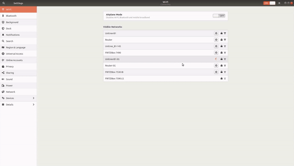
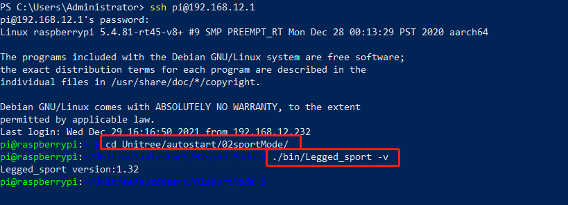
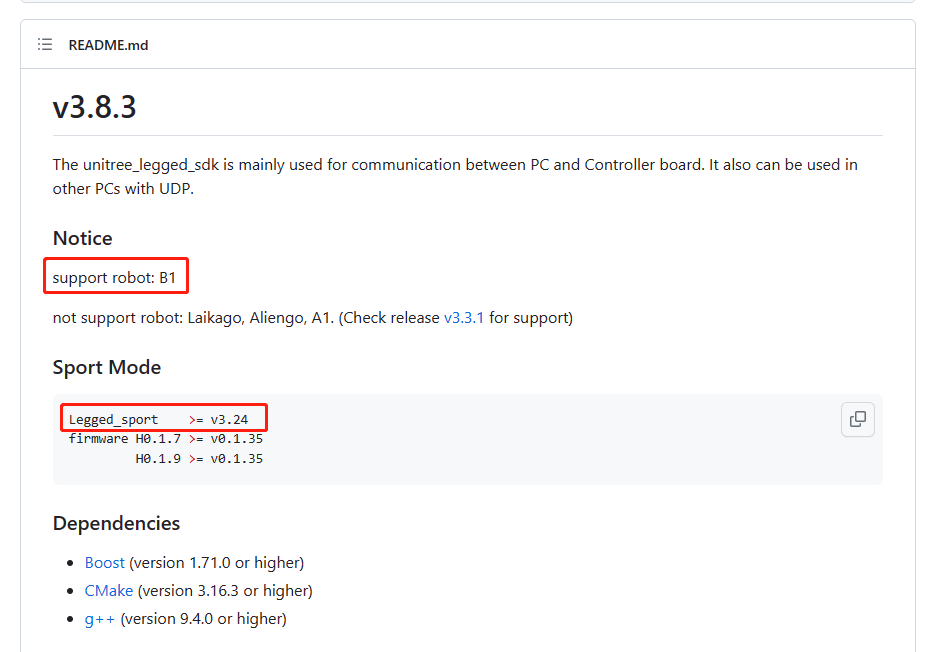
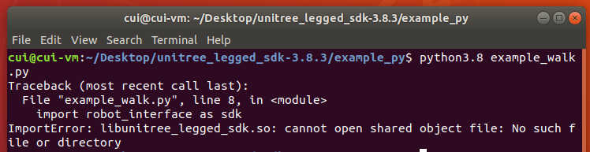
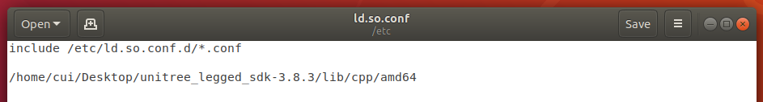
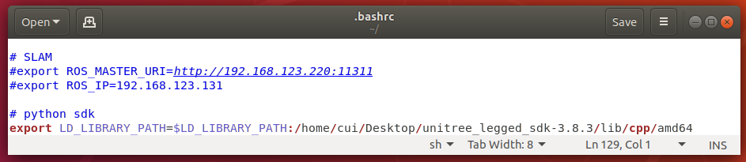

# Network Setup
For network setup please connect the ethernet cable that is provided with the robot from the robot to your computer. After that set-up a static connection (TBD!).

## Network IPs
The robot has the following networks as of *21-Mar-2023* and may vary in future versions, the following table shows the networks

| Device | Network Address | Password |
|--------|-----------------|----------|
| B1-MCU | 192.168.12.1    |    123   |
| BZ1-MCU| 192.168.123.220 |    123   |

## Wifi Network 
 users can connect to the native hot-spot of the robot or through the Ethernet port to access its on-board computers. The SSID of the Wifi network of the robot's hot-spot begins with UnitreeRoboticsB1-###, where the hash tags represent the the robot's model number and the default password is `00000000` or 8 zeros.
 <div style='text-align:center;'>

</div>

## Exercise program version query   
1. Connect to the hotspot of the robot dog (the factory setting WiFi name is Unitree_B1-xxx, password 00000000)
2. ssh to the sports host (address 192.168.12.1, username unitree, password 123)
```
ssh unitree@192.168.12.1
123
```
3. Query exercise program version
```
cd Unitree/autostart/sportMode
./bin/Legged_sport -v
```
<div style='text-align:center;'>

</div>

## SDK version selection and robot dog operating mode

B1 SDK link:
https://github.com/unitreerobotics/unitree_legged_sdk/tree/B1
Check the requirements in the readme to determine whether the motion program meets the requirements.
<div style='text-align:center;'>

</div>

## sdk required dependencies and running permissions

Please read the readme file carefully before use. This file contains the dependencies required by the SDK and the method of compiling and running.
- rely
    
    See the readme file for required dependencies; If the system is on a dog, the required dependencies have been installed and can be compiled and used directly; If you are on your own PC, you can install it according to the dependency requirements. There is a download link in the readme.

- compile

    See the readme file for compilation methods; The cmakelist file will automatically select and call the amd64 or arm64 version of the library file according to the hardware platform.

- run

    See the readme file for usage instructions; To run the compiled file, sudo permission is required to lock the memory.


# Common Problem

Dynamic library file libunitree_legged_sdk.so link error
<div style='text-align:center;'>

</div>

Solution: 
1. Configure the /etc/ld.so.conf file
<div style='text-align:center;'>

</div>

Add the path of the dynamic library to the /etc/ld.so.conf file. After saving, remember to sudo ldconfig to make the configuration take effect.

1. Configure ~/.bashrc file
<div style='text-align:center;'>

</div>

Add the path of the dynamic library to the /.bashrc file, save it and reopen the terminal to make it take effect.  