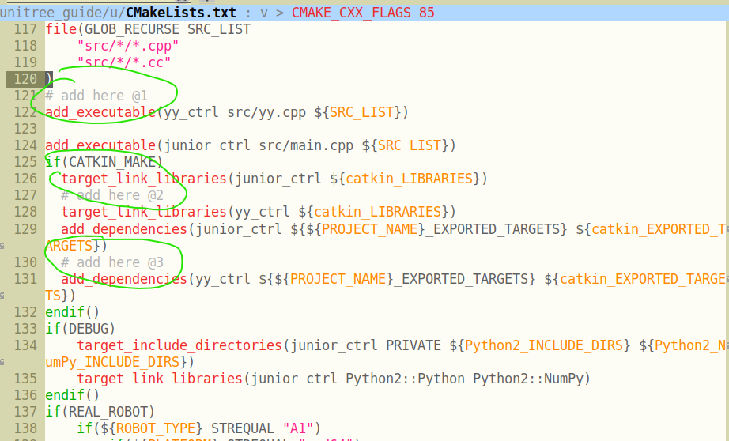

The `unitree_guide` only provides keyboard control, so if we want to control the simulated robot's movements by sending ROS messages from an external process, we need to make some minor modifications to the original code. In this section, an examplary message Control Panel implemented is discussed and detailed.

The source code for `junior_ctrl` is located in the `main.cpp` within the `unitree_guide/unitree_guide/src` directory. It begins by creating an instance of the `IOROS` class to initialize the IO interfaces. This instance is then used as an instantiation parameter for creating an object of the `CtrlComponents` class, specifying some simulation parameters, such as the simulation time units, and so forth. This object is then used as an instantiation parameter to create a `ControlFrame` object, which continually calls the `run` method for ongoing operation.

Within the constructor of the `IOROS` class, we can find the initialization of the keyboard object:

```c++
// unitree_guide/unitree_guide/src/interface/IOROS.cpp

IOROS::IOROS():IOInterface(){
    std::cout << "The control interface for ROS Gazebo simulation" << std::endl;
    ros::param::get("/robot_name", _robot_name);
    std::cout << "robot_name: " << _robot_name << std::endl;

    // start subscriber
    initRecv();
    ros::AsyncSpinner subSpinner(1); // one threads
    subSpinner.start();
    usleep(300000);     //wait for subscribers start
    // initialize publisher
    initSend();

    signal(SIGINT, RosShutDown);

    cmdPanel = new KeyBoard();
}
```

Since we can't provide a Panel parameter to `IOROS` to select a custom Panel, it is necessary to define a new class, here named `YYROS`. It will release the created KeyBoard object and use the constructor parameter as the actual Panel object to be used:

```c++
// new class inherited from IOROS

class YYROS : public IOROS {
public:
    YYROS(CmdPanel *myCmdPanel);
    ~YYROS();
};
// use another control pannel instead of Keyboard
YYROS::YYROS(CmdPanel *myCmdPanel):IOROS::IOROS() {
    delete cmdPanel;
    cmdPanel = myCmdPanel;
}

YYROS::~YYROS() {}
```

Based on the `cmdPanel` type and the superclass of `KeyBoard`, it's not difficult to discern that `KeyBoard` inherits from the `CmdPanel` class. Here, a new `CmdPanel` is reimplemented by referencing `KeyBoard`:

```c++
class YYPanel : public CmdPanel {
public:
        YYPanel();
        ~YYPanel();
private:
        void* run (void *arg);
        static void* runyy(void *arg);
        pthread_t _tid;
        void checkCmdCallback(const std_msgs::Int32 i);
        void changeValueCallback(const geometry_msgs::Point p);

        // ros specified variable
        // state change listener;
        ros::Subscriber yycmd;
        // velocity change listener;
        ros::Subscriber yyvalue;
};
```
The `KeyBoard` class achieves updates of commands or velocity information by starting a new thread to receive user inputs and update variables. Here, based on the same approach, using `pthread_create` to invoke the `spin()` method in a new thread, the information published from other ROS nodes can be read:

```c++
YYPanel::YYPanel() {
        userCmd = UserCommand::NONE;
        userValue.setZero();
        ros::NodeHandle n;
        // register message callback functions
        yycmd = n.subscribe("yycmd", 1, &YYPanel::checkCmdCallback, this);
        yyvalue = n.subscribe("yyvalue", 1, &YYPanel::changeValueCallback, this);
        pthread_create(&_tid, NULL, runyy, (void*)this);
}

YYPanel::~YYPanel() {
        pthread_cancel(_tid);
        pthread_join(_tid, NULL);
}

void* YYPanel::runyy(void *arg) {
        ((YYPanel*)arg)->run(NULL);
        return NULL;
}

void* YYPanel::run(void *arg) {
        ros::MultiThreadedSpinner spinner(4);
        spinner.spin();
        return NULL;
}
```

Here, `yycmd` represents the status values of the robotic dog, while the `x` and `y` components of `yyvalue` represent the velocity components along the coordinate directions on a plane, and `z` denotes the angular velocity around the z-axis.

Here is the complete code:
```c++
/**********************************************************************
 Copyright (c) 2020-2023, Unitree Robotics.Co.Ltd. All rights reserved.
***********************************************************************/
#include <iostream>
#include <unistd.h>
#include <csignal>
#include <sched.h>

#include "control/ControlFrame.h"
#include "control/CtrlComponents.h"

#include "Gait/WaveGenerator.h"

#include "interface/KeyBoard.h"
#include "interface/IOROS.h"

#include <std_msgs/Int32.h>
#include <geometry_msgs/Point.h>

// new class inherited from IOROS

class YYROS : public IOROS {
public:
        YYROS(CmdPanel *myCmdPanel);
        ~YYROS();
};
// use another control pannel instead of Keyboard
YYROS::YYROS(CmdPanel *myCmdPanel):IOROS::IOROS() {
        delete cmdPanel;
        cmdPanel = myCmdPanel;
}
// do nothing
YYROS::~YYROS() {}

class YYPanel : public CmdPanel {
public:
        YYPanel();
        ~YYPanel();
private:
        void* run (void *arg);
        static void* runyy(void *arg);
        pthread_t _tid;
        void checkCmdCallback(const std_msgs::Int32 i);
        void changeValueCallback(const geometry_msgs::Point p);

        // ros specified variable
        // state change listener;
        ros::Subscriber yycmd;
        // velocity change listener;
        ros::Subscriber yyvalue;
};

YYPanel::YYPanel() {
        userCmd = UserCommand::NONE;
        userValue.setZero();
        ros::NodeHandle n;
        // register message callback functions
        yycmd = n.subscribe("yycmd", 1, &YYPanel::checkCmdCallback, this);
        yyvalue = n.subscribe("yyvalue", 1, &YYPanel::changeValueCallback, this);
        pthread_create(&_tid, NULL, runyy, (void*)this);
}

YYPanel::~YYPanel() {
        pthread_cancel(_tid);
        pthread_join(_tid, NULL);
}

void* YYPanel::runyy(void *arg) {
        ((YYPanel*)arg)->run(NULL);
        return NULL;
}

void* YYPanel::run(void *arg) {
        ros::MultiThreadedSpinner spinner(4);
        spinner.spin();
        return NULL;
}

void YYPanel::checkCmdCallback(std_msgs::Int32 i) {
        ROS_INFO("%d", i.data);
        //*
        UserCommand tmp;
        switch (i.data){
        case 1:
                tmp = UserCommand::L2_B;
                break;
        case 2:
                tmp = UserCommand::L2_A;
                break;
        case 3:
                tmp = UserCommand::L2_X;
                break;
        case 4:
                tmp = UserCommand::START;
                break;
#ifdef COMPILE_WITH_MOVE_BASE
        case 5:
                tmp = UserCommand::L2_Y;
                break;
#endif  // COMPILE_WITH_MOVE_BASE
        case 6:
                tmp = UserCommand::L1_X;
                break;
        case 9:
                tmp = UserCommand::L1_A;
                break;
        case 8:
                tmp = UserCommand::L1_Y;
                break;
        case 0:
                userValue.setZero();
                tmp = UserCommand::NONE;
                break;
        default:
                tmp = UserCommand::NONE;
                break;
        }
        userCmd = tmp;
        //*/
}

void YYPanel::changeValueCallback(const geometry_msgs::Point p)
{
        //ROS_INFO("speed: %f, %f, %f", p.x, p.y, p.z);
        // (x, y, z)
        // x for x-axis speed, y for y-axis speed, z for rotate speed
        //*
          userValue.lx = p.x;
          userValue.ly = p.y;
          userValue.rx = p.z;
        //*/
}

/*
 */

bool running = true;

// over watch the ctrl+c command
void ShutDown(int sig)
{
        std::cout << "stop the controller" << std::endl;
        running = false;
}

int main(int argc, char **argv)
{
        /* set the print format */
        std::cout << std::fixed << std::setprecision(3);

        ros::init(argc, argv, "unitree_gazebo_servo");

        IOInterface *ioInter;
        CtrlPlatform ctrlPlat;

        ioInter = new YYROS(new YYPanel());
        ctrlPlat = CtrlPlatform::GAZEBO;

        CtrlComponents *ctrlComp = new CtrlComponents(ioInter);
        ctrlComp->ctrlPlatform = ctrlPlat;
        ctrlComp->dt = 0.002; // run at 500hz
        ctrlComp->running = &running;

        ctrlComp->robotModel = new Go1Robot();

        ctrlComp->waveGen = new WaveGenerator(0.45, 0.5, Vec4(0, 0.5, 0.5, 0)); // Trot
        // ctrlComp->waveGen = new WaveGenerator(1.1, 0.75, Vec4(0, 0.25, 0.5, 0.75));  //Crawl, only for sim
        //ctrlComp->waveGen = new WaveGenerator(0.4, 0.6, Vec4(0, 0.5, 0.5, 0));  //Walking Trot, only for sim
        //ctrlComp->waveGen = new WaveGenerator(0.4, 0.35, Vec4(0, 0.5, 0.5, 0));  //Running Trot, only for sim
        // ctrlComp->waveGen = new WaveGenerator(0.4, 0.7, Vec4(0, 0, 0, 0));  //Pronk, only for sim

        ctrlComp->geneObj();

        ControlFrame ctrlFrame(ctrlComp);

        // deal with Ctrl+C
        signal(SIGINT, ShutDown);

        while (running)
        {
                ctrlFrame.run();
        }

        delete ctrlComp;
        return 0;
}
```
It is then necessary to place the above `yy.cpp` file in the same directory as the `main.cpp`, and modify the `CMakeLists.txt` in the `/unitree_guide/unitree_guide` directory at the position shown in the picture below, and then re-run `catkin build`, and  have a simulation controller that can accept ROS message controls:



It is then possibile to have ROS nodes to send data to `yycmd` and `yyvalue`. After starting `yy_ctrl` (`./devel/lib/unitree_guide/yy_ctrl`), the messages will be transmitted to the simulation environment. Below is the code I used during testing:

```python
import rospy
from geometry_msgs.msg import Point

pub = rospy.Publisher('yyvalue', Point, queue_size=10)
rospy.init_node('yytry', anonymous=True)
rate = rospy.Rate(10)

i = 0.0

while not rospy.is_shutdown():
    pub.publish( Point(x=i, y=i, z=i))
    rospy.loginfo(i)
    i = i + 1
    rate.sleep()

```

```python
import rospy
from std_msgs.msg import Int32

pub = rospy.Publisher('yycmd', Int32, queue_size=10)
rospy.init_node('yytry', anonymous=True)
rate = rospy.Rate(10)

i = 0

while not rospy.is_shutdown():
    pub.publish(i)
    rospy.loginfo(i)
    i = i + 1
    rate.sleep()
```


*The content of this page is fully taken from: https://egh0bww1.com/posts/2023-10-25-unitree-go1-collection-en/*