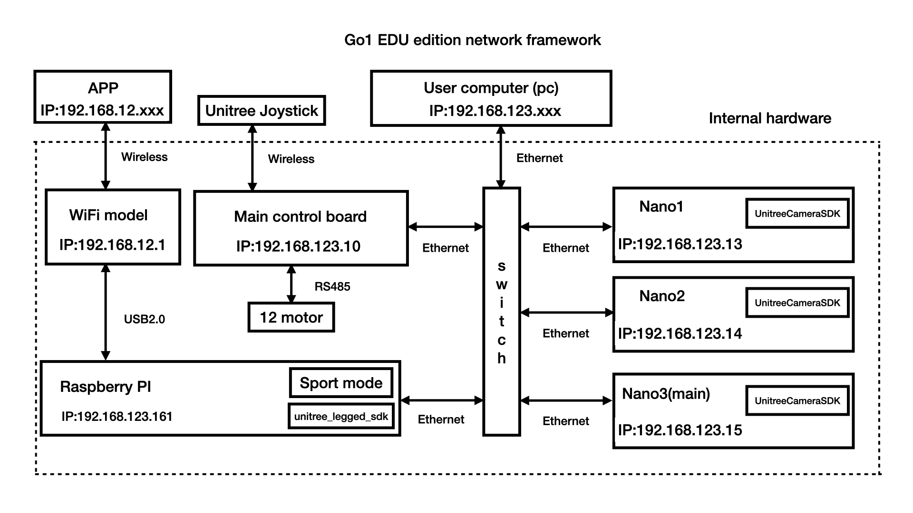
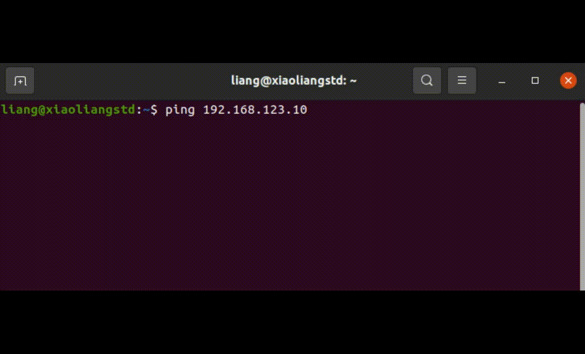
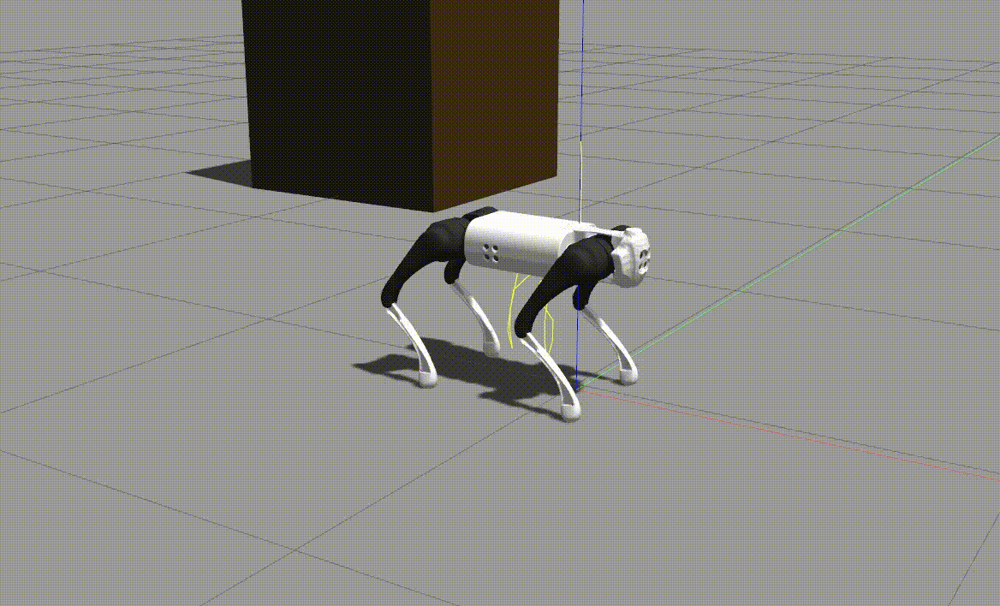
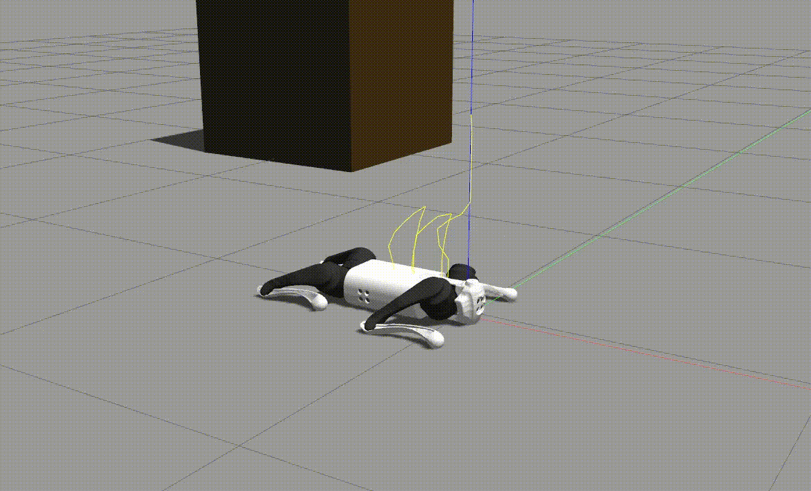
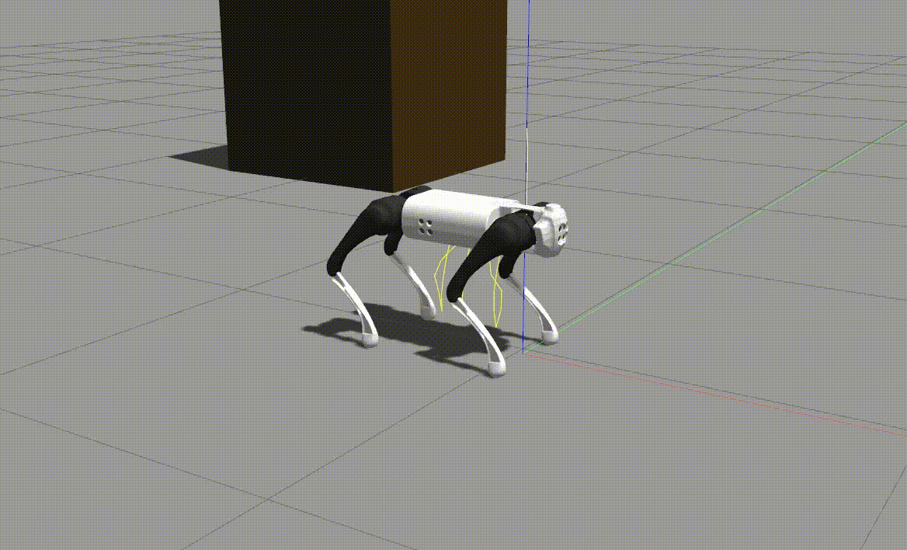
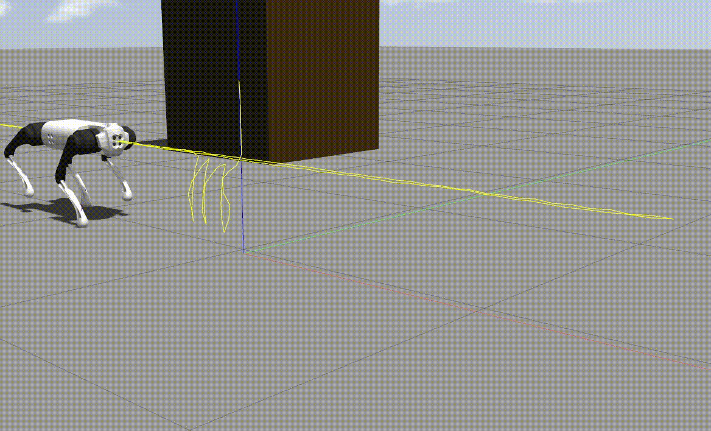
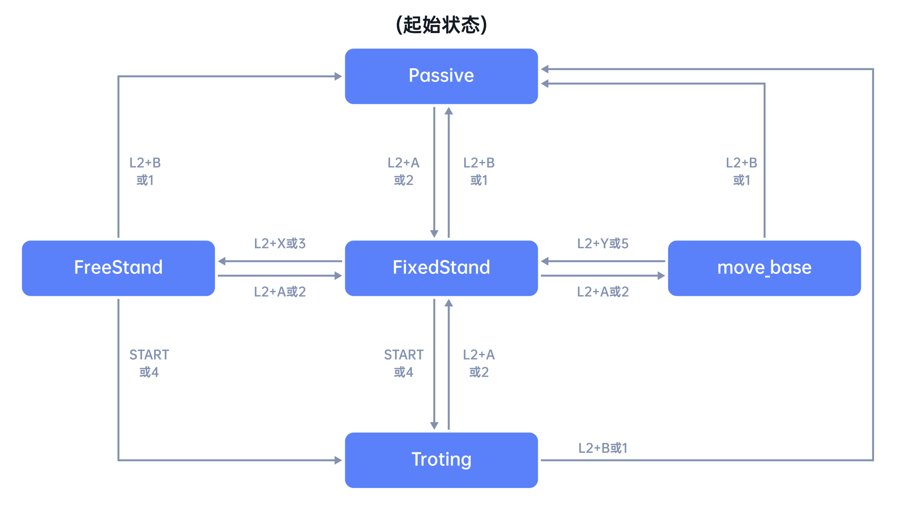
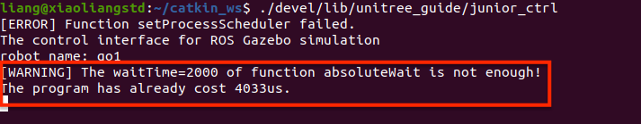
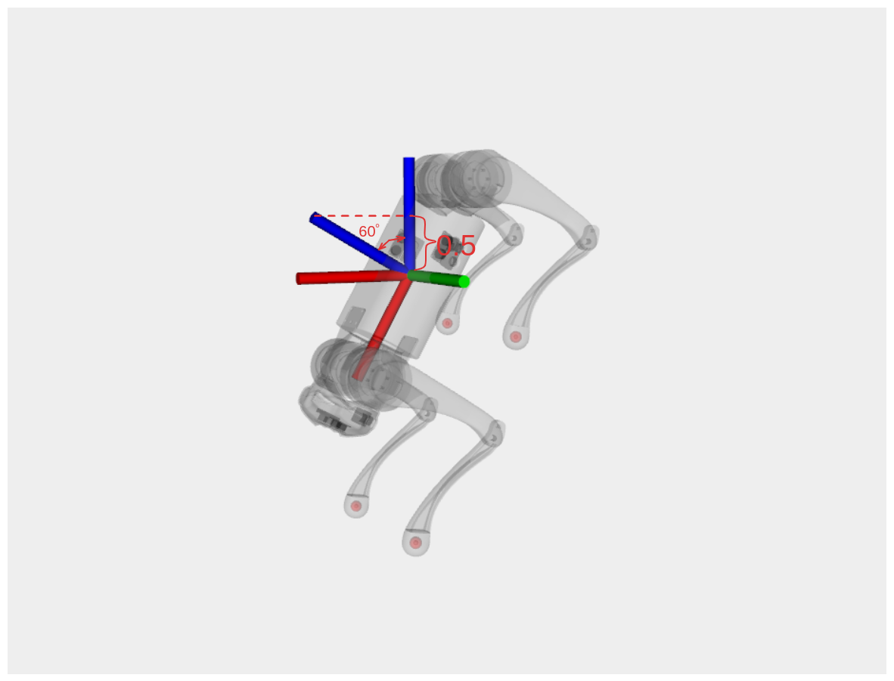

# Go1 Robot Network Framework

The Go1 Education Edition has five onboard computers including an  UP Board, a Raspberry Pi-4B, and three Jetson nano computers. The five computers also communicate with each other through a switch.



The ping command is used to test whether communication can be established using the specified IP address. Here is an example of testing whether communication with the main control board is established.
```
$ ping 192.168.123.10
```
If the result is similar to the image below, communication is established



The scp (Secure Copy) command can copy files between multiple computers. For example, to send the unitree_guide package to the Go1 robot’s Raspberry Pi, you would run the following command:

```
scp -r unitree_guide pi@192.168.123.161:/home/pi
```

# Finite State Machine
Finite state machines (FSM) are mainly used to manage and control the behavior of robots, such as the robot's standing, posture control, advancement, etc. The source code files for finite state machines in the unitree_guide project can be found in the [FSM](https://github.com/unitreerobotics/unitree_guide/tree/main/unitree_guide/src/FSM) folder. The following will explain the state machine in unitree_guide.

### Passive State
In the Passive state, all joint motors of the robot will be set to damping mode. Regarding the damping mode of the joint motor, simply speaking, it is to set the expected rotation speed of the joint to 0 rad/s and the stiffness coefficient (Kp) to 0. Therefore, at this time, the greater the rotation speed of the joint under the action of external force, the greater the rotation speed will be. Increasing resistance thus reduces the rotational speed of the joint. If the robot is standing at this time, the robot will slowly fall down under the influence of gravity. This state is also often used to protect the robot in some emergency situations, such as an accidental fall.


*For emergency situation handling, or if you need to optimize related strategies, please refer to the FSM::checkSafty() function.*


### FixedStand State
In this state, all joints of the robot will slowly rotate to a given joint angle and then lock. By setting the given joint angle to the joint angle when the robot is standing, the robot can stand.


### FreeStand State
In this state, the robot can control the height and posture of the robot's body when standing in place according to the instructions of Yushu's handle or keyboard.


### Trotting State
In this state, the user can control the robot to walk, turn, and stop.


*In the simulation environment, press the `W` `A` `S` `D` keys on the keyboard to control the robot to move forward and translate left and the rear legs to the right respectively. Press the `J` `L` keys on the keyboard to control the robot to turn left and right respectively . On the real robot, you can only use the Yushu handle controls the robot to achieve the above movements.*


## State machine switching
The figure below shows the various states of the robot and the switching conditions. Each box in the figure below represents a state. Between the two boxes is the state switching condition. The direction of the arrow indicates the state transition direction when the switching condition is met.



*For switching conditions: L2+A : This means you need to press the L2 key and A key on the Yushu handle at the same time . This is only effective when controlling the physical robot. "2" : This means you need to press the L2 key and A key on the keyboard. Number "2" key, this is only effective when controlling the robot in the simulation environment.*

## State Machine Manager -- FSM class

The FSM class plays the role of state machine manager in the unitree_guide project. `Passive` It can control the initialization , running `FixedStand`, switching, and exit of the states mentioned above `Trotting`. The following will be partially explained based on the program source code.

## FSM::FSM constructor
```
FSM::FSM(CtrlComponents *ctrlComp)
    :_ctrlComp(ctrlComp){

    _stateList.invalid = nullptr;
    _stateList.passive = new State_Passive(_ctrlComp);
    _stateList.fixedStand = new State_FixedStand(_ctrlComp);
    _stateList.freeStand = new State_FreeStand(_ctrlComp);
    _stateList.trotting = new State_Trotting(_ctrlComp);
    _stateList.balanceTest = new State_BalanceTest(_ctrlComp);
    _stateList.swingTest = new State_SwingTest(_ctrlComp);
    _stateList.stepTest = new State_StepTest(_ctrlComp);
#ifdef COMPILE_WITH_MOVE_BASE
    _stateList.moveBase = new State_move_base(_ctrlComp);
#endif  // COMPILE_WITH_MOVE_BASE
    initialize();
}
```

In the constructor of FSM, the main purpose is to create objects of each state machine and assign them to the pointers of each state machine in the _stateList structure for easy calling.

## Detailed explanation of FSM::run function
```
void FSM::run(){
    _startTime = getSystemTime();
    _ctrlComp->sendRecv();
    _ctrlComp->runWaveGen();
    _ctrlComp->estimator->run();
    if(!checkSafty()){
        _ctrlComp->ioInter->setPassive();
    }

    if(_mode == FSMMode::NORMAL){
        _currentState->run();
        _nextStateName = _currentState->checkChange();
        if(_nextStateName != _currentState->_stateName){
            _mode = FSMMode::CHANGE;
            _nextState = getNextState(_nextStateName);
            std::cout << "Switched from " << _currentState->_stateNameString
                      << " to " << _nextState->_stateNameString << std::endl;
        }
    }
    else if(_mode == FSMMode::CHANGE){
        _currentState->exit();
        _currentState = _nextState;
        _currentState->enter();
        _mode = FSMMode::NORMAL;
        _currentState->run();
    }

    absoluteWait(_startTime, (long long)(_ctrlComp->dt * 1000000));
}
```

1. All logic of the entire project (such as estimator iteration, information command sending and receiving, state machine operation, state switching, etc.) is executed in the FSM::run() function. First, record the current system real time through the getSystemTime() method. Then execute the code sequentially. At the bottom of the function, there is the [absoluteWait()](https://github.com/unitreerobotics/unitree_guide/blob/main/unitree_guide/include/common/timeMarker.h) function. Executing this function will also first get the latest system time after all logic has been executed. The time difference obtained by subtracting these two periods (indicating the time required to run all logic in a single time) will be the same as the time specified in _ctrlComp->dt The time is subtracted (converted into microseconds). If the result is positive, it means a timeout, and the terminal will report a program warning. If the result is negative, it means that the program is running too fast, and the usleep() function will be called for delay.


2. 
```
_ctrlComp->sendRecv(); //Control the command to be sent and received once
_ctrlComp->runWaveGen(); // Calculate gait parameters
_ctrlComp->estimator->run(); // The state estimator iterates once
if(!checkSafty()){ // Perform safety check
   _ctrlComp->ioInter->setPassive(); // If combined with safety conditions, set each joint to enter the damping state to protect the robot
}
```
3. This code shows the switching process of the state machine. The state machine manager has two modes: `FSMMode::NORMAL` and `FSMMode::CHANGE`. The initial mode of the state machine manager is `FSMMode::NORMAL`. The initial state of the robot is PASSIVE. Once we cause the checkChange() function to return a _stateName that is different from the current state through keyboard or controller instructions, the state machine manager will switch to `FSMMode::CHANGE` mode to start switching between states. It can be seen that the state machine switching will first execute the exit() function of the current state. In order to enter multiple times, you need to pay attention to resetting some flag bits in the exit() function.

## FSM::checkSafty() function
```
bool FSM::checkSafty(){
    // The angle with z axis less than 60 degree
    if(_ctrlComp->lowState->getRotMat()(2,2) < 0.5 ){
        return false;
    }else{
        return true;
    }
}
```
The getRotMat() function will get the rotation matrix representing the torso posture read from the IMU. Each column of the rotation matrix represents the projection of the corresponding coordinate axis in the world coordinate system. The figure below is a simple illustration of this protection strategy:


*This protection strategy has been added by default when the state machine of the entire project is running. If users need to verify some extreme movements (such as front flips, back flips, New Year greetings, etc.), they need to pay attention to the impact of this strategy.*