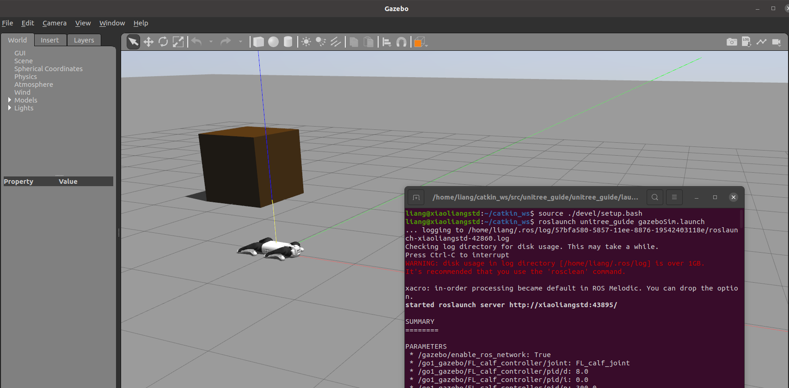
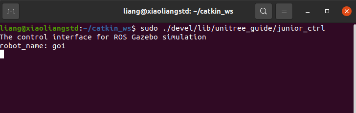

# Quick Start
This part describes how to run unitree_guide in the Gazebo emulator to quickly get started with the unitree_guide project. 

## Environment preparation and package installation

- We recommend users to run this project on Ubuntu 18.04 system and melodic version of ROS system (Ubuntu 20.04 system and noetic version of ROS system are also available). To ensure the running effect, users are not recommended to run this project in a virtual machine.

- run `lcm-tester` command to test whether LCM is installed.

    
    If the content displayed on the terminal is similar to the picture above, it means that LCM has been installed.

- Run `getconf GNU_LIBPTHREAD_VERSION` the command to test whether the pthread library has been installed

    
    If the version information can be displayed, it means that the pthread library has been installed.

- If the `DEBUG` option is set to Python2 `off`, there is no need to install it. The project sets this option to `off` by default.

- Download these three packages and move them to the src folder of a certain ROS workspace (this article uses catkin_ws as an example). The final file structure is as shown in the figure below.

    unitree_guide :
https://github.com/unitreerobotics/unitree_guide

    unitree_ros :
https://github.com/unitreerobotics/unitree_ros

    unitree_legged_msgs :
https://github.com/unitreerobotics/unitree_ros_to_real

    *unitree_legged_msgs is a sub-package under the unitree_ros_to_real package. The unitree_legged_msgs package needs to be moved out separately.*

## Compile   

Open a terminal and switch the working path to the root directory of the ros workspace containing the unitree_guide project (this article assumes that the path is ~/catkin_ws), and run `catkin_make` to start compiling the project. 


## Run
Getting started with unitree_guide is a two-step process.

- Run Gazebo simulation environment:
```
$ source ./devel/setup.bash
$ roslaunch unitree_guide gazeboSim.launch
```
After executing this command, the Gazebo simulator window will pop up, and the Go1 robot will lie on the ground in the simulation environment.



- Start the controller:
 
To make the robot move, you also need to activate the controller. Open another terminal and switch to the same path (this article assumes that the path is ~/catkin_ws), and then enter the following command to start the controller:
 
```
$ sudo ./devel/lib/unitree_guide/junior_ctrl
``` 
If no error is displayed on the terminal and the content displayed on the terminal is similar to the picture below, it proves that the controller has been started successfully. At this time, the Go1 robot is still lying on the ground. Some simple methods will be introduced below to make the Go1 robot move in the simulation environment.



Press the `2` key on your keyboard. At this time, the robot in the Gazebo environment will stand up, and the terminal will display "Switched from passive to fixed stand".


Next, select the terminal and press the `4` key on the keyboard. After the terminal displays "Press "Switched from fixed stand to trotting" on the keyboard, press the `w` key on the keyboard twice. The robot can move forward slowly. Press the `space` key on the keyboard and the robot will stop.


- Fixing the floating-base 

    Sometimes users need to test or verify a certain part of the logic separately. In this case, the robot needs to be suspended in the simulation to obtain the best observation effect. It is therefore necessary to find the `gazeboSim.launch` file, and change `user_debugthe` parameters of the parameter item from `false` to `true` and save the changed file, as shown in the figure below
    

    and consequently use the command `roslaunch unitree_guide gazeboSim.launch` to open the simulator and you will find that the robot has been suspended
    


## Common Issues
### Compilation -llcm Error
Some users may encounter the terminal prompt "Invoking "make -j4 -l4" failed" error when compiling unitree_guide, as shown in the figure below.


At this time, the user needs to find the specific error message on the terminal information. If there is "/usr/ bin/ld: can not find -llcm" or "/usr/bin/ld: can not find -llcm" fields, proves that the lcmlibrary has not been installed in the user's computer environment. lcmThis problem can be solved by installing the library.

### Starting the controller - 1
When starting the controller, the terminal may prompt that some dynamic library so files cannot be found, as shown in the figure below:


This is caused by the system not recognizing the relevant dynamic library path. The solution is as follows:

- Find the dynamic library address and system dynamic library path of the ROS system in the current computer environment:
generally /opt/ros/{name of the ROS version installed by the user}/lib. Users can use the ls command in Linux with the Tab key on the keyboard to find the path. The system dynamic library path is generally `/usr/local/lib`

- Open a terminal and use any text editor to open the dynamic library path configuration file (here, gedit is used as an example: `sudo gedit /etc/ld.so.conf`). 
When a window will pop up, and the prepared path can be entered at the bottom of the file. The author's current environment settings can be seen in the figure below

After editing and saving, enter `sudo ldconfig` in the terminal to take effect immediately. Then starting the controller again should resolve the issue.

### Starting the controller - 2
When starting the controller, the terminal may prompt "[ERROR] Function setProcessScheduler failed.", as shown in the figure below.


When starting the controller, you need to give the controller program the highest authority. For related content, please refer to << Quadruped Robot Control Algorithm >> Section 10.3 Real-time Processes.

First of all, when this content appears on the terminal, you can still control the robot through unitree_guide. This is just a warning error. 
This error may occur because you started the controller in one of these two ways: rosrun or without sudo. Just use the following methods to start the controller, namely `sudo ./devel/lib/unitree_guide/junior_ctrl`

### Starting the controller - 3
When controlling robot movement, the terminal may prompt "[WARNING] The waitTime=2000 of function absoluteWait is not enough!", which means that the controller has timed out.


The operating frequency of the controller designed in the unitree_guide project is 500hz, which means that the entire process including foot reaction force solution, information sending and receiving, etc. needs to be completed within 0.002s (2000 microseconds). If it is subject to factors such as computer performance, complex control logic, etc., the entire process may eventually take more than 0.002s. As shown in the figure above, the entire process took 4033 microseconds. After the controller is prompted to run timeout, the robot can still be controlled normally as long as the timeout is not too frequent and outrageous.

This problem is caused by multiple factors and the solution can be;

- Reduce output statements such as "std::cout" in the program
- Try to avoid using a virtual machine to run this project
- Use sudo to give the controller program the highest privileges to set up the real-time process
- Set up multi-threading to separate the foot-end reaction force calculation and information sending and receiving in the program and run them in different threads.


### Rosrun for starting the controller
After successfully compiling the unitree_guide project, the binary file (junior_ctrl) for the controller will be generated in the devel/lib/unitree_guide path of the corresponding ROS workspace. As for why it is not recommended to use the following command to start the controller: `rosrun unitree_guide junior_ctrl`, because during the movement of the robot, it is necessary to ensure that the expected foot force is solved at a fixed frequency (500hz), and this involves knowledge of the real-time process. Setting up the real-time process in the program requires the highest authority. And these two Only the first of the startup commands can give the controller program the highest authority.


